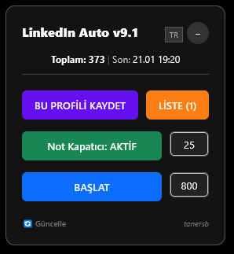

# 🚀 LinkedIn Fast Sequential Auto Connect

**A sophisticated, safe, and modern userscript designed to automate connection requests on LinkedIn.**
*Features Shadow DOM support, Human-Like behavior simulation, and a fully interactive GUI.*

  <a href="#-key-features">Features</a> •
  <a href="#-installation">Installation</a> •
  <a href="#-how-to-use">How To Use</a> •
  <a href="#-disclaimer">Disclaimer</a>

---

## ⚠️ Disclaimer & Educational Purpose

> **Please Read Carefully:**
> This software is developed **strictly for educational and research purposes**. The goal of this project is to demonstrate:
> 1. How to interact with complex DOM structures (**Shadow DOM**) using JavaScript.
> 2. How to simulate native browser events (`EventDispatch`) for **Human-Like behavior**.
> 3. How to create modern overlays (GUI) without external libraries.
>
> **Use at your own risk.** The author (@tanersb) is not responsible for any account restrictions. While the script is designed to be undetectable, automation always carries a risk.

---

## 📸 Interface

---

## ✨ Key Features

### 🛡️ Anti-Detection & Safety
| Feature | Description |
| :--- | :--- |
| **🧠 Human-Like Interaction** | Unlike bots that use simple `.click()`, this script uses **Native Event Dispatching** (`mouseover` → `mousedown` → `mouseup` → `click`) to mimic real human mouse interaction. |
| **🥷 Shadow DOM Support** | Successfully penetrates LinkedIn's `#interop-outlet` (Shadow Root) to find and click hidden buttons like "Send without note". |

### 🎛️ Modern UI & Controls
| Feature | Description |
| :--- | :--- |
| **🎨 Interactive Panel** | A clean, dark-themed control panel placed conveniently above the messaging tab. |
| **⚡ Dynamic Speed** | Adjust `Popup Delay` and `Connection Speed` in milliseconds on the fly via the GUI. |
| **📊 Smart Counters** | Tracks total connections sent and records the exact time of the last action. |
| **💾 Auto-Save** | Remembers your speed settings, total count, and last activity date even after refreshing. |
| **👻 Mini Mode** | Can be minimized to a small `@tanersb` badge to save screen space. |

---

## 📥 Installation

1.  **Install Manager:** Install **[Tampermonkey](https://www.tampermonkey.net/)** (Recommended) or Violentmonkey for your browser.
2.  **Install Script:** **[Click Here to Install the Script](https://github.com/tanersb/LinkedIn-Fast-Sequential-Auto-Connect/raw/refs/heads/main/linkedin-fast-sequential.user.js)**.
3.  **Navigate:** Go to LinkedIn and search for people (e.g., Search "HR Manager" → Filter by **People**).
4.  **Launch:** The panel will appear automatically on the bottom right.

---

## ⚙️ How to Use

The panel consists of two main modules:

### 1️⃣ Not Kapatıcı (Note Closer)
* **Status:** `ACTIVE` (Default)
* **Function:** Automatically detects the "Add a note" popup and clicks **"Send without note"** instantly.
* **Speed:** Default `100ms` (Adjustable via input).

### 2️⃣ Bağlantıyı Başlat (Start Connector)
* **Status:** Click button to `START`.
* **Function:** Scans the page for "Connect" (Bağlantı kur) buttons and clicks them sequentially.
* **Speed:** Default `1000ms` (Adjustable via input).

> **💡 Pro Tip:** To reset your session counters and history, click on the **"Total: X | Last: ..."** text area.

---

## 🤝 Contributing

Contributions, issues, and feature requests are welcome!
Feel free to check the [Issues Page](https://github.com/tanersb/LinkedIn-Fast-Sequential-Auto-Connect/issues).

---

**Designed by [@tanersb](https://github.com/tanersb)**
*Distributed under the MIT License*

